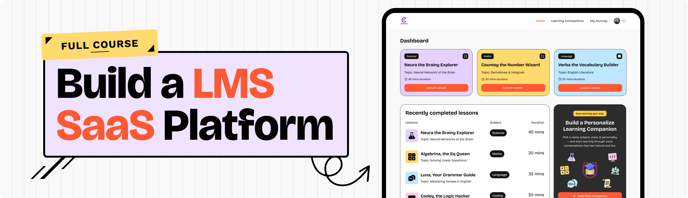

<div align="center">  
  <br />  
  <a href="https://www.youtube.com/watch?v=XUkNR-JfHwo" target="_blank">  
      
  </a>  
  <br />  

  <div>  
      
      
      
  </div>  

  <h3 align="center">LMS SaaS App – Built with Next.js, Supabase & AI Voice Agents</h3>  

  <div align="center">  
    This project is a faithful recreation of the LMS SaaS tutorial by <a href="https://www.youtube.com/@javascriptmastery" target="_blank"><b>JavaScript Mastery</b></a>.  
    All credits for the code and design go to JSM – I followed the tutorial to learn and replicate the project as part of my learning journey.  
  </div>  
</div>  

---
## 🎬 Demo Video

Watch an overview  of main feature of the project in action:

[![Demo Video] https://github.com/user-attachments/assets/cf99be77-83ec-4ef6-8211-2aad2bde6023 ]


---

## 📋 Table of Contents

1. 🤖 [Introduction](#introduction)
2. ⚙️ [Tech Stack](#tech-stack)
3. 🔋 [Features](#features)
4. 🚀 [Getting Started](#getting-started)
5. 🙌 [Credits](#credits)

---

## 🤖 Introduction

This LMS (Learning Management System) SaaS platform allows users to engage with AI-powered voice tutors, manage sessions, track learning progress, and handle authentication and billing — all in a sleek, responsive UI.

The original project was created by **JavaScript Mastery** and is fully explained in [this video tutorial](https://www.youtube.com/watch?v=XUkNR-JfHwo). I followed the tutorial step-by-step to build this version.

---

## ⚙️ Tech Stack

* **Next.js** – Full-stack React framework
* **Supabase** – Real-time database and authentication
* **Clerk** – Authentication and user management
* **Stripe** – Subscription billing
* **Vapi** – Voice AI interaction
* **Tailwind CSS** – Utility-first styling
* **shadcn/ui** – UI component library
* **Zod** – Schema validation
* **Sentry** – Error tracking
* **TypeScript** – Type-safe development

---

## 🔋 Features

✅ **AI Voice Tutors** — Speak to custom-built voice agents
✅ **Authentication** — Secure logins with Clerk and Google OAuth
✅ **Payments** — Subscription plans with Stripe integration
✅ **Bookmarks & History** — Track your sessions and favorite tutors
✅ **Tutor Creation** — Build your own AI tutor persona
✅ **Fully Responsive** — Mobile-friendly and modern UI
✅ **Search & Filters** — Find tutors quickly
✅ **Modular Codebase** — Easy to extend and refactor

---

## 🚀 Getting Started

### Prerequisites

* [Node.js](https://nodejs.org/)
* [npm](https://www.npmjs.com/)
* [Git](https://git-scm.com/)

### Clone and Install

```bash
git clone https://github.com/your-username/your-repo-name.git
cd your-repo-name
npm install
```

### Environment Variables

Create a `.env` file in the root and add:

```env
# Sentry
SENTRY_AUTH_TOKEN=

# Vapi
NEXT_PUBLIC_VAPI_WEB_TOKEN=

# Clerk
NEXT_PUBLIC_CLERK_PUBLISHABLE_KEY=
CLERK_SECRET_KEY=
NEXT_PUBLIC_CLERK_SIGN_IN_URL=/sign-in
NEXT_PUBLIC_CLERK_SIGN_IN_FALLBACK_REDIRECT_URL=/
NEXT_PUBLIC_CLERK_SIGN_UP_FALLBACK_REDIRECT_URL=/

# Supabase
NEXT_PUBLIC_SUPABASE_URL=
NEXT_PUBLIC_SUPABASE_ANON_KEY=
```

> Sign up for keys from [Supabase](https://supabase.com), [Clerk](https://clerk.com), [Stripe](https://stripe.com), and [Vapi](https://vapi.dev).

### Run the App

```bash
npm run dev
```

Then go to `http://localhost:3000`

---

## 🙌 Credits

* 💻 Original project & code by [JavaScript Mastery](https://www.youtube.com/@javascriptmastery)
* 🎥 Full tutorial available here: [Build a SaaS LMS with Next.js](https://www.youtube.com/watch?v=XUkNR-JfHwo)
* 🧠 This repo was created for learning purposes and to demonstrate my understanding of the tools and architecture.

---

Let me know if you’d like to include deployment instructions (like with Vercel), a license section, or customize the wording further!
